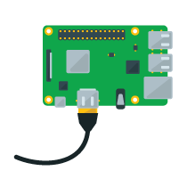

Ophrys Signage
=========================================================

* Web Site: https://www.irisbroadcast.org
* Github: https://github.com/IrisBroadcast/OphrysSignage

A simple way to display a webpage on a screen without all the fuzz.
Basic signage solution with configuration page for url selection,
screen rotation and option to fetch configuration settings from
external server. We are using it with Debian Buster on
Raspberry Pi 3 and 4. This should work fine on other hardwares
as well. Let us know if you run into any problems or have any questions.

We use it to display system monitoring and door-signage for our studios.

#### Components
- Whiptail install script (Guides the installation of dependencies)
- Debian + OpenBox + LightDM + Feh
- Chromium Browser + OMXPlayer
- NodeJs server for configuration
- Bash scripts for setting URLs and screen rotation

#### Features
- Fullscreen browser without window decorations
- Loading image on boot (Ophrys graphics)
- Rotate screen on both Raspberry Pi 3 and 4 without reboot
- Load a configuration JSON from an external site with settings
- REST API for page refresh and */health* endpoint for status information
- Built in multi webpage iframe view, with transitioning abilities
- Built in webpage with a studio-clock




License
=======

Ophrys Signage is Copyright (c) 2019 Roger Sandholm & Jim Eld, Stockholm, Sweden
The code is licensed under the BSD 3-clause license.

The license for Ophrys Signage is in the LICENSE.txt file


## How to get started (Using a Raspberry Pi)

First go to [Raspbian Buster Download](https://www.raspberrypi.org/downloads/) and download Raspbian Buster with desktop. It is of course possible to just download Debian 10 “Buster” with any desktop, just make sure it comes with LightDM.

Burn this image on an SD-card. We use “Balena Etcher” to get the image on to the SD-card.

Depending on your way of installing and later setup, decide between:
- Connecting a mouse and keyboard and write all the commands and follow instruction in the terminal on screen.

- Or when burning the image add an empty file to the **/boot/** folder named “SSH” without file end. This enables SSH on Debian. For remote configuration. This enables SSH with the default username “pi” and password “raspberry” on boot. The difficult part here is to of course find the ip-address of the unit.

Now it's time to download the installation tool from us to the unit, decide between:
- Use a terminal command to get the tool/script. If you want to get the tool/script using the terminal, boot up the device and open a terminal window (through SSH or with a keyboard and display). Then run:
   ```sh
   wget -O /tmp/install.tar.gz https://irisbroadcast.com/ophrys/install.tar.gz && tar -C /tmp -xvzf /tmp/install.tar.gz && sudo bash /tmp/ophrys-install.sh

   ```
   Or if you're behind a corporate proxy, use the following command instead:
   ```sh
   wget -O /tmp/install.tar.gz https://irisbroadcast.com/ophrys/install.tar.gz -e use_proxy=yes -e https_proxy=user:password@proxy.com && tar -C /tmp -xvzf /tmp/install.tar.gz && sudo bash /tmp/ophrys-install.sh
   ```

- Or download the tool/script to the **/boot/** folder when setting up the SD-card. The **/boot/** is a partition that's visible from your computer when burning the image on to the SD-card. [Script Download](http://irisbroadcast.com/ophrys/install.tar.gz). Once put in the folder, boot up the device and open a terminal. Then type the following:
   ```sh
   sudo chmod 777 && /boot/.install.sh
   ```

The script will fetch an installation tool and start it up. To continue setup follow the on-screen instructions.

### Advanced
If you want to follow along with the installation, in more detail than the whiptail interface. Check the following file:
```sh
tail -f /var/log/ophrys-full-install.log
```

When the applications and scripts are running they log to the following file:
```sh
tail -f /var/log/aloe/main.log
```

## Responsible Maintainers
- [Jim Eld](https://github.com/djhenley)
- [Roger Sandholm](https://github.com/Roog)